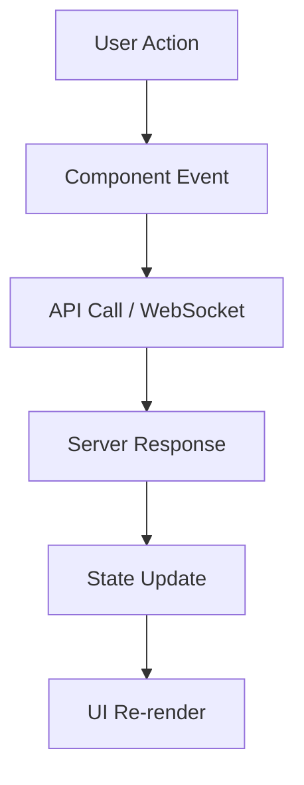

# Architecture Documentation - Client

## Executive Summary
The Mysterious Website client is a modern React-based web application built with TypeScript, featuring real-time communication, 3D graphics, and interactive games. The application follows a domain-driven architecture with clear separation of concerns and modular design.

## Technology Stack

### Core Framework
- **React 18.2.0:** Component-based UI framework with concurrent features
- **TypeScript 5.2.2:** Type-safe JavaScript development
- **Vite 5.0.8:** Fast build tool and development server

### UI and Styling
- **TailwindCSS 4.1.18:** Utility-first CSS framework
- **Framer Motion 10.18.0:** Declarative animations
- **GSAP 3.14.2:** High-performance animation library

### 3D and Graphics
- **Three.js 0.160.1:** 3D graphics rendering engine
- **React Three Fiber 8.18.0:** React renderer for Three.js
- **React Three Drei 9.122.0:** Useful helpers for React Three Fiber

### Physics and Interaction
- **Matter.js 0.20.0:** 2D physics engine for games

### Communication and Data
- **React Router DOM 7.10.1:** Client-side routing
- **SockJS Client 1.6.1:** WebSocket client
- **STOMP.js 7.2.1:** WebSocket messaging protocol
- **Axios:** HTTP client (implicit in dependencies)

### Internationalization
- **i18next 25.7.2:** Internationalization framework
- **React i18next 16.4.0:** React bindings for i18next
- **i18next Browser Language Detector 8.2.0:** Automatic language detection
- **i18next HTTP Backend 3.0.2:** Translation loading

## Architecture Pattern

### Domain-Driven Design
The application follows domain-driven design principles with each business domain organized as a separate module:

```
src/domain/
├── calendar/          # Calendar management
├── cv/               # Resume/CV functionality
├── dashboard/        # Main dashboard
├── game/             # Game systems
├── messagewall/      # Real-time chat
├── note/             # Note-taking
├── suggestions/      # Suggestion system
├── user/             # User management
└── vocabulary/       # Vocabulary learning
```

### Component Architecture

#### Component Hierarchy
```
App.tsx (Root)
├── Router Configuration
├── Internationalization Provider
├── Theme Provider
└── Domain Components
    ├── Dashboard Layout
    ├── Game Components
    ├── Message Wall
    └── Other Domain Modules
```

#### Component Patterns
- **Functional Components:** Modern React with hooks
- **Custom Hooks:** Reusable stateful logic
- **Context API:** Global state management
- **Higher-Order Components:** Cross-cutting concerns
- **Render Props:** Flexible component composition

## Data Architecture

### State Management Strategy

#### Local State
- **useState:** Component-level state
- **useReducer:** Complex component state
- **useContext:** Global application state

#### Server State
- **Custom Hooks:** API data fetching
- **WebSocket Integration:** Real-time updates
- **Optimistic Updates:** Immediate UI feedback

#### Data Flow


### API Integration

#### HTTP Client Architecture
```typescript
// API client structure
const apiClient = {
  // REST endpoints
  messages: {
    getAll: () => fetch('/api/messages'),
    create: (message) => fetch('/api/messages', { method: 'POST', body: message })
  },
  
  // WebSocket integration
  websocket: {
    connect: () => new SockJS('/ws/messages'),
    subscribe: (client, destination, callback) => client.subscribe(destination, callback)
  }
};
```

#### WebSocket Integration
```typescript
// WebSocket management
class WebSocketManager {
  private client: any;
  
  connect() {
    this.client = new SockJS('/ws/messages');
    const stompClient = Stomp.over(this.client);
    
    stompClient.connect({}, () => {
      this.subscribeToMessages();
      this.subscribeToSystemEvents();
    });
  }
  
  private subscribeToMessages() {
    this.client.subscribe('/topic/messages', (message: any) => {
      const newMessage = JSON.parse(message.body);
      // Update state with new message
    });
  }
}
```

## Component Architecture Details

### Game Domain Architecture

#### 3D Game Integration
```typescript
// Game component structure
const GameComponent: React.FC = () => {
  const [gameState, setGameState] = useState<GameState>();
  
  return (
    <Canvas>
      <ambientLight intensity={0.5} />
      <PhysicsEngine>
        <GameWorld gameState={gameState} />
        <PlayerController />
        <GameUI />
      </PhysicsEngine>
    </Canvas>
  );
};
```

#### Physics Integration
- **Matter.js Engine:** 2D physics simulation
- **Collision Detection:** Real-time collision handling
- **Force Application:** Gravity, impulses, and forces

### Message Wall Architecture

#### Real-time Messaging
```typescript
// Message wall component
const MessageWall: React.FC = () => {
  const [messages, setMessages] = useState<Message[]>([]);
  const [connectionStatus, setConnectionStatus] = useState<'connected' | 'disconnected'>('disconnected');
  
  useEffect(() => {
    const wsManager = new WebSocketManager();
    wsManager.connect();
    
    wsManager.onMessage((newMessage) => {
      setMessages(prev => [...prev, newMessage]);
    });
    
    return () => wsManager.disconnect();
  }, []);
  
  return (
    <div className="message-wall">
      <MessageList messages={messages} />
      <MessageInput onSend={wsManager.sendMessage} />
    </div>
  );
};
```

## Performance Architecture

### Code Splitting Strategy
```typescript
// Lazy loading for domains
const Dashboard = lazy(() => import('./domain/dashboard/Dashboard'));
const Game = lazy(() => import('./domain/game/Game'));
const MessageWall = lazy(() => import('./domain/messagewall/MessageWall'));

// Route-based splitting
const AppRouter = () => (
  <Router>
    <Suspense fallback={<LoadingSpinner />}>
      <Routes>
        <Route path="/" element={<Dashboard />} />
        <Route path="/game" element={<Game />} />
        <Route path="/chat" element={<MessageWall />} />
      </Routes>
    </Suspense>
  </Router>
);
```

### Optimization Techniques

#### Rendering Optimization
- **React.memo:** Component memoization
- **useMemo:** Expensive calculations caching
- **useCallback:** Function reference stability
- **Virtualization:** Large list rendering

#### Bundle Optimization
```typescript
// vite.config.ts
export default defineConfig({
  build: {
    rollupOptions: {
      output: {
        manualChunks: {
          vendor: ['react', 'react-dom'],
          three: ['three', '@react-three/fiber', '@react-three/drei'],
          ui: ['framer-motion', 'gsap'],
          i18n: ['i18next', 'react-i18next']
        }
      }
    }
  }
});
```

## Security Architecture

### Client-Side Security
- **Input Validation:** Form validation and sanitization
- **XSS Prevention:** Safe HTML rendering
- **CSRF Protection:** Token-based request validation
- **Content Security Policy:** Secure resource loading

### Authentication Integration
```typescript
// Authentication context
const AuthContext = createContext<AuthContextType>();

export const AuthProvider: React.FC<{ children: React.ReactNode }> = ({ children }) => {
  const [user, setUser] = useState<User | null>(null);
  const [isAuthenticated, setIsAuthenticated] = useState(false);
  
  const login = async (credentials: LoginCredentials) => {
    try {
      const response = await apiClient.auth.login(credentials);
      setUser(response.user);
      setIsAuthenticated(true);
      localStorage.setItem('authToken', response.token);
    } catch (error) {
      console.error('Login failed:', error);
    }
  };
  
  return (
    <AuthContext.Provider value={{ user, isAuthenticated, login, logout }}>
      {children}
    </AuthContext.Provider>
  );
};
```

## Internationalization Architecture

### Multi-Language Support
```typescript
// i18n configuration
import i18n from 'i18next';
import { initReactI18next } from 'react-i18next';

i18n
  .use(initReactI18next)
  .init({
    resources: {
      en: { translation: require('./locales/en.json') },
      fr: { translation: require('./locales/fr.json') },
      zh: { translation: require('./locales/zh.json') }
    },
    lng: 'en',
    fallbackLng: 'en',
    interpolation: { escapeValue: false }
  });
```

### Namespace Organization
- **Common:** Shared translations
- **Domain-specific:** Translation per domain
- **Dynamic Loading:** On-demand translation loading

## Testing Architecture

### Testing Strategy
- **Unit Tests:** Component logic testing
- **Integration Tests:** Component interaction
- **E2E Tests:** User flow testing
- **Visual Regression:** UI consistency

### Test Structure
```typescript
// Component testing example
describe('MessageWall', () => {
  it('should display messages', () => {
    const mockMessages = [
      { id: '1', message: 'Hello World', userId: 'user1' }
    ];
    
    render(<MessageWall messages={mockMessages} />);
    
    expect(screen.getByText('Hello World')).toBeInTheDocument();
  });
  
  it('should send new message', async () => {
    const mockSendMessage = jest.fn();
    
    render(<MessageInput onSend={mockSendMessage} />);
    
    fireEvent.change(screen.getByPlaceholderText('Type a message...'), {
      target: { value: 'New message' }
    });
    
    fireEvent.click(screen.getByText('Send'));
    
    expect(mockSendMessage).toHaveBeenCalledWith('New message');
  });
});
```

## Development Workflow Architecture

### Build Process
```typescript
// Build configuration
interface BuildConfig {
  mode: 'development' | 'production';
  target: 'es2020';
  minify: boolean;
  sourcemap: boolean;
}

const buildApp = (config: BuildConfig) => {
  // TypeScript compilation
  // Bundle optimization
  // Asset processing
  // Source map generation
};
```

### Development Tools
- **Hot Module Replacement:** Instant development feedback
- **Type Checking:** Real-time TypeScript validation
- **Linting:** Code quality enforcement
- **Formatting:** Consistent code style

## Deployment Architecture

### Build Outputs
```bash
# Production build
npm run build

# Output structure
dist/
├── assets/           # Static assets (CSS, JS, images)
├── index.html        # Main HTML file
└── vite.svg         # Icon
```

### Deployment Strategy
- **Static Hosting:** CDN or static file server
- **Environment Configuration:** Build-time environment variables
- **Asset Optimization:** Compression and caching
- **Progressive Web App:** PWA capabilities

## Future Architecture Enhancements

### Planned Improvements
1. **Micro-Frontends:** Domain decomposition
2. **Web Workers:** Background processing
3. **Service Workers:** Offline capabilities
4. **WebAssembly:** Performance-critical computations
5. **Server Components:** React Server Components integration

### Scalability Considerations
- **Component Libraries:** Shared design system
- **State Management:** Redux or Zustand for complex state
- **Performance Monitoring:** Real-time performance tracking
- **Error Boundaries:** Graceful error handling
