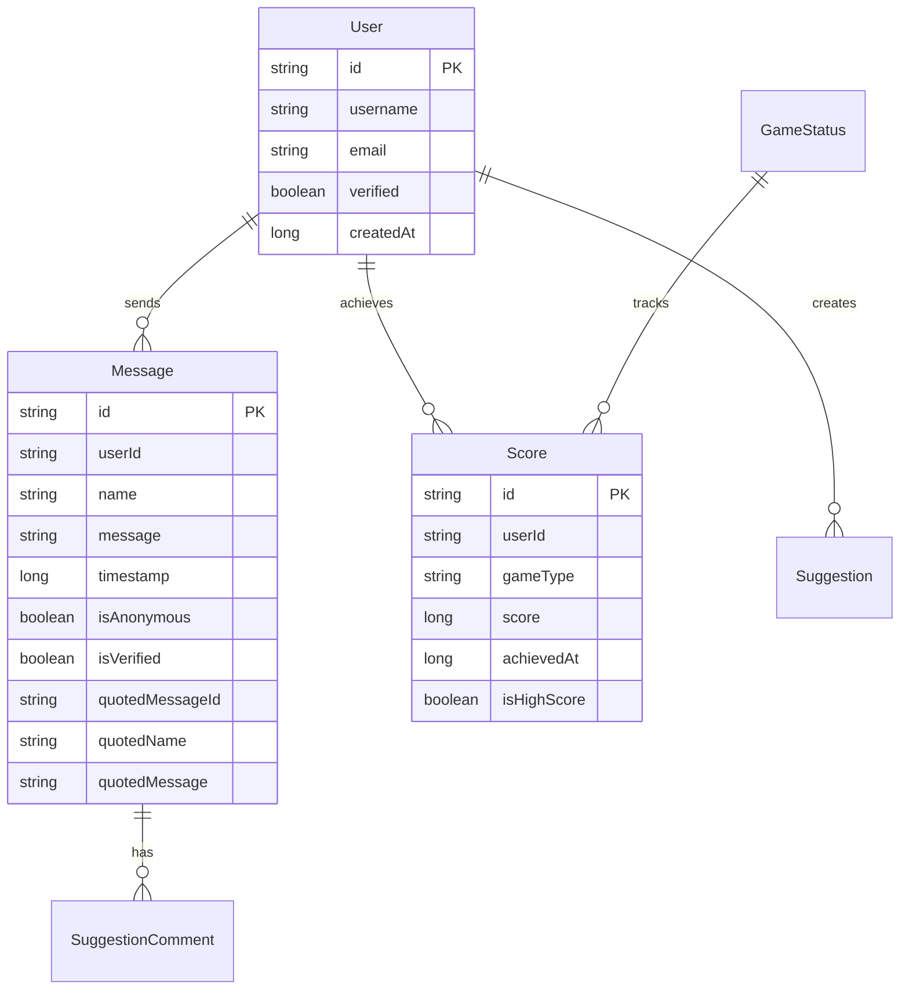

# Architecture Documentation - Server

## Executive Summary
The Mysterious Website server is a Spring Boot-based Java backend that provides RESTful APIs, real-time WebSocket communication, and data persistence for a multi-domain web application. The architecture follows domain-driven design principles with clear separation of concerns and modular structure.

## Technology Stack

### Core Framework
- **Spring Boot 3.2.1:** Application framework and auto-configuration
- **Java 17:** Programming language with modern features
- **Maven:** Dependency management and build tool

### Data Persistence
- **Spring Data JPA:** Object-relational mapping
- **Hibernate:** JPA implementation
- **PostgreSQL:** Primary database
- **Liquibase:** Database migration management

### Web and Communication
- **Spring Web:** REST API framework
- **Spring WebSocket:** Real-time communication
- **SockJS & STOMP:** WebSocket messaging protocol
- **Jackson:** JSON serialization/deserialization

### Validation and Security
- **Spring Boot Validation:** Bean validation
- **Spring Security:** Authentication and authorization (implicit)

### Development and Testing
- **Spring Boot Test:** Testing framework
- **JUnit 5:** Unit testing
- **Mockito:** Mocking framework

## Architecture Pattern

### Domain-Driven Design
The application follows domain-driven design with each business domain organized as a separate module:

```
com.changrui.mysterious.domain/
├── calendar/          # Calendar configuration
├── game/             # Game systems and scoring
├── messagewall/      # Real-time messaging
├── note/             # Note management
├── onlinecount/      # Online user tracking
├── settings/         # System settings
├── suggestions/      # Suggestion system
├── user/             # User management
└── vocabulary/       # Vocabulary learning
```

### Layered Architecture
Each domain follows a consistent layered pattern:

```
domain/
├── controller/       # REST endpoints and WebSocket handlers
├── service/         # Business logic and orchestration
├── repository/      # Data access layer
├── model/           # JPA entities
└── dto/             # Data transfer objects
```

## Data Architecture

### Database Design

#### Entity Relationships


#### Database Schema
- **Primary Database:** PostgreSQL
- **Connection Pooling:** HikariCP
- **Migration Strategy:** Liquibase changelogs
- **Transaction Management:** Spring @Transactional

### JPA Entity Architecture

#### Base Entity Pattern
```java
@MappedSuperclass
public abstract class BaseEntity {
    @Id
    private String id;
    
    @Column(name = "created_at", nullable = false)
    private long createdAt;
    
    @Column(name = "updated_at")
    private long updatedAt;
    
    @PrePersist
    protected void onCreate() {
        createdAt = System.currentTimeMillis();
        updatedAt = createdAt;
    }
    
    @PreUpdate
    protected void onUpdate() {
        updatedAt = System.currentTimeMillis();
    }
}
```

#### Entity Example
```java
@Entity
@Table(name = "messages")
public class Message extends BaseEntity {
    
    @Column(name = "user_id", nullable = false)
    private String userId;
    
    @Column(nullable = false, length = 500)
    private String message;
    
    @Column(name = "is_anonymous", nullable = false, columnDefinition = "boolean default false")
    private boolean isAnonymous;
    
    @Column(name = "is_verified", nullable = false, columnDefinition = "boolean default false")
    private boolean isVerified;
    
    // Relationships
    @ManyToOne(fetch = FetchType.LAZY)
    @JoinColumn(name = "user_id", insertable = false, updatable = false)
    private User user;
    
    // Constructors, getters, setters
}
```

## API Architecture

### REST API Design

#### Controller Pattern
```java
@RestController
@RequestMapping("/api/messages")
@Validated
public class MessageController {
    
    private final MessageService messageService;
    private final MessageWebSocketController webSocketController;
    
    @GetMapping
    public ResponseEntity<List<Message>> getAllMessages() {
        List<Message> messages = messageService.getAllMessages();
        return ResponseEntity.ok()
                .header("X-System-Muted", String.valueOf(messageService.isMuted()))
                .body(messages);
    }
    
    @PostMapping
    public ResponseEntity<ApiResponse<Message>> addMessage(
            @Valid @RequestBody Message message,
            @RequestParam(required = false) String adminCode) {
        
        // Business logic delegation
        Message saved = messageService.addMessage(message, adminCode);
        
        // Real-time broadcast
        webSocketController.broadcastNewMessage(saved);
        
        return ResponseEntity.ok(ApiResponse.success(saved));
    }
}
```

#### Response Standardization
```java
public class ApiResponse<T> {
    private boolean success;
    private String message;
    private T data;
    
    public static <T> ApiResponse<T> success(T data) {
        return new ApiResponse<>(true, "Success", data);
    }
    
    public static <T> ApiResponse<T> success(String message, T data) {
        return new ApiResponse<>(true, message, data);
    }
    
    public static <T> ApiResponse<T> error(String message) {
        return new ApiResponse<>(false, message, null);
    }
}
```

### WebSocket Architecture

#### WebSocket Configuration
```java
@Configuration
@EnableWebSocketMessageBroker
public class WebSocketConfig implements WebSocketMessageBrokerConfigurer {
    
    @Override
    public void registerStompEndpoints(StompEndpointRegistry registry) {
        registry.addEndpoint("/ws/messages")
                .setAllowedOriginPatterns("*")
                .withSockJS();
    }
    
    @Override
    public void configureMessageBroker(MessageBrokerRegistry registry) {
        registry.enableSimpleBroker("/topic");
        registry.setApplicationDestinationPrefixes("/app");
    }
}
```

#### Message Broadcasting
```java
@Controller
public class MessageWebSocketController {
    
    private final SimpMessagingTemplate messagingTemplate;
    
    public void broadcastNewMessage(Message message) {
        messagingTemplate.convertAndSend("/topic/messages", message);
    }
    
    public void broadcastDelete(String messageId) {
        messagingTemplate.convertAndSend("/topic/delete", messageId);
    }
    
    public void broadcastMuteStatus(boolean muted) {
        messagingTemplate.convertAndSend("/topic/mute", muted);
    }
}
```

## Service Layer Architecture

### Business Logic Pattern
```java
@Service
@Transactional
public class MessageService {
    
    private final MessageRepository messageRepository;
    private final UserVerificationService userVerificationService;
    private final AdminService adminService;
    
    public Message addMessage(Message message, String adminCode) {
        // Validation
        if (messageService.isMuted() && !adminService.isValidAdminCode(adminCode)) {
            throw new UnauthorizedException("Chat is muted by admin");
        }
        
        // Business logic
        if (userVerificationService.userExists(message.getUserId()) || 
            adminService.isValidAdminCode(adminCode)) {
            message.setVerified(true);
        }
        
        // Quote handling
        handleQuotedMessage(message);
        
        // Persistence
        return messageRepository.save(message);
    }
    
    private void handleQuotedMessage(Message message) {
        if (message.getQuotedMessageId() != null) {
            Message quoted = messageRepository.findById(message.getQuotedMessageId())
                    .orElse(null);
            if (quoted != null) {
                message.setQuotedName(quoted.getName());
                message.setQuotedMessage(quoted.getMessage());
            } else {
                message.setQuotedMessageId(null);
            }
        }
    }
}
```

### Transaction Management
```java
@Service
@Transactional
public class GameService {
    
    @Transactional(readOnly = true)
    public List<Score> getHighScores(String gameType) {
        return scoreRepository.findByGameTypeAndIsHighScoreTrueOrderByScoreDesc(gameType);
    }
    
    @Transactional
    public Score submitScore(ScoreSubmissionDTO dto) {
        Score score = new Score();
        score.setUserId(dto.getUserId());
        score.setGameType(dto.getGameType());
        score.setScore(dto.getScore());
        score.setAchievedAt(System.currentTimeMillis());
        
        // Check if high score
        List<Score> existingHighScores = getHighScores(dto.getGameType());
        boolean isHighScore = existingHighScores.size() < 10 || 
                           dto.getScore() > existingHighScores.get(9).getScore();
        score.setHighScore(isHighScore);
        
        return scoreRepository.save(score);
    }
}
```

## Security Architecture

### Authentication and Authorization

#### Admin Verification
```java
@Service
public class AdminService {
    
    @Value("${app.admin.code}")
    private String adminCode;
    
    public boolean isValidAdminCode(String providedCode) {
        return adminCode.equals(providedCode);
    }
    
    @PreAuthorize("hasRole('ADMIN')")
    public void performAdminAction() {
        // Admin-only operations
    }
}
```

#### User Verification
```java
@Service
public class UserVerificationService {
    
    private final UserRepository userRepository;
    
    public boolean userExists(String userId) {
        return userRepository.existsById(userId);
    }
    
    public User getVerifiedUser(String userId) {
        return userRepository.findById(userId)
                .filter(User::isVerified)
                .orElseThrow(() -> new UserNotFoundException(userId));
    }
}
```

### Input Validation
```java
@RestController
public class MessageController {
    
    @PostMapping
    public ResponseEntity<ApiResponse<Message>> addMessage(
            @Valid @RequestBody MessageDTO messageDTO,
            @RequestParam(required = false) String adminCode) {
        
        // DTO validation with Bean Validation
        Message message = convertToEntity(messageDTO);
        Message saved = messageService.addMessage(message, adminCode);
        
        return ResponseEntity.ok(ApiResponse.success(saved));
    }
}

public class MessageDTO {
    
    @NotBlank(message = "Message content is required")
    @Size(max = 500, message = "Message must be less than 500 characters")
    private String message;
    
    @NotBlank(message = "User ID is required")
    private String userId;
    
    @NotBlank(message = "Name is required")
    private String name;
    
    // Validation annotations and getters/setters
}
```

## Performance Architecture

### Database Optimization

#### Connection Pooling
```yaml
# application.yml
spring:
  datasource:
    hikari:
      maximum-pool-size: 20
      minimum-idle: 5
      connection-timeout: 30000
      idle-timeout: 600000
      max-lifetime: 1800000
      leak-detection-threshold: 60000
```

#### Query Optimization
```java
@Repository
public interface MessageRepository extends JpaRepository<Message, String> {
    
    @Query("SELECT m FROM Message m ORDER BY m.timestamp DESC")
    List<Message> findAllOrderByTimestampDesc();
    
    @Query("SELECT m FROM Message m WHERE m.userId = :userId ORDER BY m.timestamp DESC")
    List<Message> findByUserIdOrderByTimestampDesc(@Param("userId") String userId);
    
    @Modifying
    @Query("DELETE FROM Message m WHERE m.timestamp < :cutoffTime")
    void deleteOldMessages(@Param("cutoffTime") long cutoffTime);
}
```

### Caching Strategy
```java
@Service
public class GameStatusService {
    
    @Cacheable(value = "gameStatus", key = "#gameType")
    public GameStatus getGameStatus(String gameType) {
        return gameStatusRepository.findByGameType(gameType)
                .orElse(new GameStatus(gameType, false));
    }
    
    @CacheEvict(value = "gameStatus", key = "#gameType")
    public void updateGameStatus(String gameType, boolean enabled) {
        GameStatus status = getGameStatus(gameType);
        status.setEnabled(enabled);
        status.setLastUpdated(System.currentTimeMillis());
        gameStatusRepository.save(status);
    }
}
```

## Error Handling Architecture

### Global Exception Handling
```java
@ControllerAdvice
public class GlobalExceptionHandler {
    
    @ExceptionHandler(UnauthorizedException.class)
    public ResponseEntity<ApiResponse<Void>> handleUnauthorized(UnauthorizedException ex) {
        return ResponseEntity.status(HttpStatus.UNAUTHORIZED)
                .body(ApiResponse.error(ex.getMessage()));
    }
    
    @ExceptionHandler(ValidationException.class)
    public ResponseEntity<ApiResponse<Void>> handleValidation(ValidationException ex) {
        return ResponseEntity.status(HttpStatus.BAD_REQUEST)
                .body(ApiResponse.error(ex.getMessage()));
    }
    
    @ExceptionHandler(Exception.class)
    public ResponseEntity<ApiResponse<Void>> handleGeneric(Exception ex) {
        log.error("Unexpected error", ex);
        return ResponseEntity.status(HttpStatus.INTERNAL_SERVER_ERROR)
                .body(ApiResponse.error("Internal server error"));
    }
}
```

## Testing Architecture

### Test Structure
```java
@ExtendWith(MockitoExtension.class)
class MessageServiceTest {
    
    @Mock
    private MessageRepository messageRepository;
    
    @Mock
    private UserVerificationService userVerificationService;
    
    @Mock
    private AdminService adminService;
    
    @InjectMocks
    private MessageService messageService;
    
    @Test
    void shouldCreateVerifiedMessageForExistingUser() {
        // Given
        Message message = new Message("1", "user1", "Test", "Hello", System.currentTimeMillis(), false, false);
        when(userVerificationService.userExists("user1")).thenReturn(true);
        when(messageRepository.save(any(Message.class))).thenReturn(message);
        
        // When
        Message result = messageService.addMessage(message, null);
        
        // Then
        assertThat(result.isVerified()).isTrue();
        verify(messageRepository).save(message);
    }
    
    @Test
    void shouldRejectMessageWhenMutedWithoutAdminCode() {
        // Given
        Message message = new Message("1", "user1", "Test", "Hello", System.currentTimeMillis(), false, false);
        when(adminService.isValidAdminCode(null)).thenReturn(false);
        when(messageService.isMuted()).thenReturn(true);
        
        // When & Then
        assertThatThrownBy(() -> messageService.addMessage(message, null))
                .isInstanceOf(UnauthorizedException.class)
                .hasMessage("Chat is muted by admin");
    }
}
```

## Configuration Architecture

### Application Configuration
```yaml
# application.yml
spring:
  application:
    name: mysterious-backend
    
  datasource:
    url: jdbc:postgresql://localhost:5432/messagewall
    username: postgres
    password: postgres
    driver-class-name: org.postgresql.Driver
    
  jpa:
    hibernate:
      ddl-auto: validate
    show-sql: false
    properties:
      hibernate.format_sql: false
      hibernate.dialect: org.hibernate.dialect.PostgreSQLDialect
      
  liquibase:
    change-log: classpath:db/changelog/db.changelog-master.xml
    
server:
  port: 8080
  compression:
    enabled: true
    
app:
  admin:
    code: admin123
  websocket:
    allowed-origins: "*"
```

### Profile-Based Configuration
```yaml
# application-prod.yml
spring:
  datasource:
    url: ${DATABASE_URL}
    username: ${DATABASE_USERNAME}
    password: ${DATABASE_PASSWORD}
    
  jpa:
    show-sql: false
    
logging:
  level:
    com.changrui.mysterious: INFO
    org.springframework.security: WARN
  file:
    name: logs/application.log
```

## Monitoring and Observability

### Actuator Configuration
```yaml
management:
  endpoints:
    web:
      exposure:
        include: health,info,metrics,prometheus
  endpoint:
    health:
      show-details: when-authorized
  metrics:
    export:
      prometheus:
        enabled: true
```

### Custom Health Indicators
```java
@Component
public class WebSocketHealthIndicator implements HealthIndicator {
    
    @Override
    public Health health() {
        try {
            // Check WebSocket connectivity
            boolean isHealthy = checkWebSocketHealth();
            return isHealthy ? 
                Health.up().withDetail("websocket", "Connected").build() :
                Health.down().withDetail("websocket", "Disconnected").build();
        } catch (Exception e) {
            return Health.down().withException(e).build();
        }
    }
}
```

## Future Architecture Enhancements

### Planned Improvements
1. **Microservices:** Service decomposition by domain
2. **Event-Driven Architecture:** Message queue integration
3. **CQRS:** Command Query Responsibility Segregation
4. **Event Sourcing:** Immutable event log
5. **Distributed Tracing:** Request tracking across services

### Scalability Considerations
- **Database Sharding:** Horizontal data partitioning
- **Read Replicas:** Read scaling
- **Caching Layer:** Redis integration
- **Load Balancing:** Multiple instance deployment
