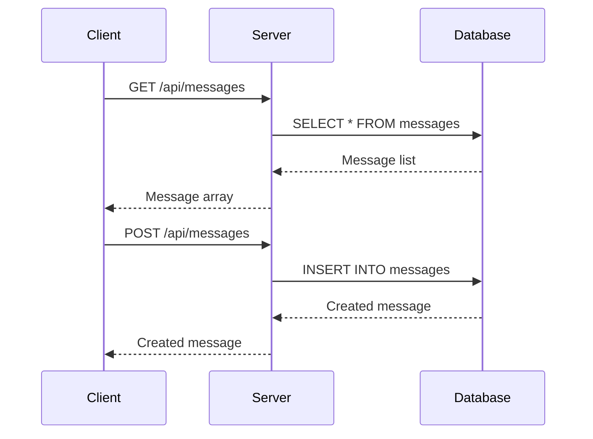
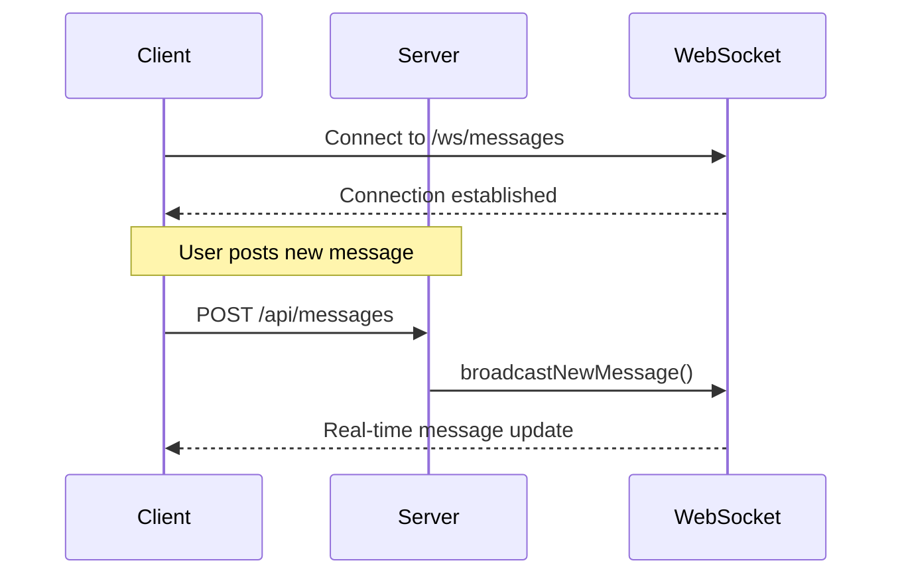
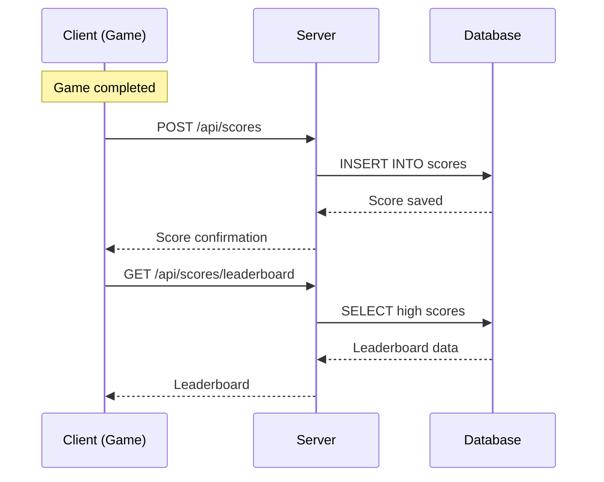
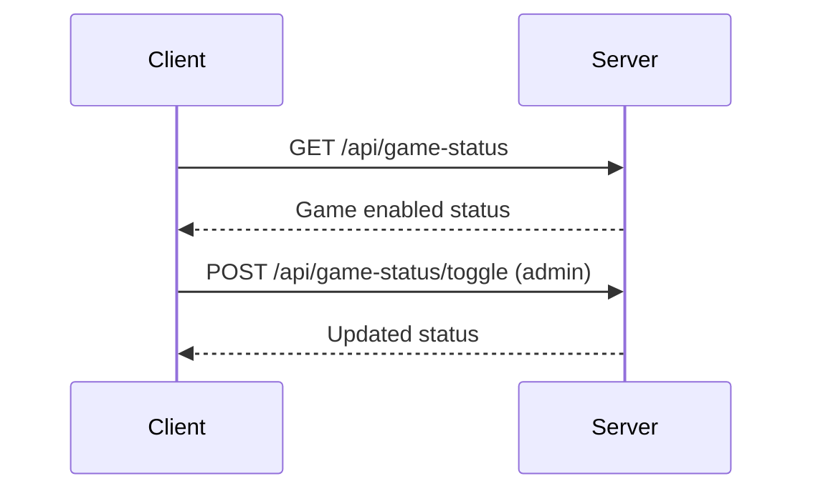
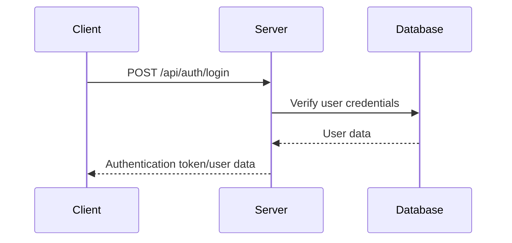
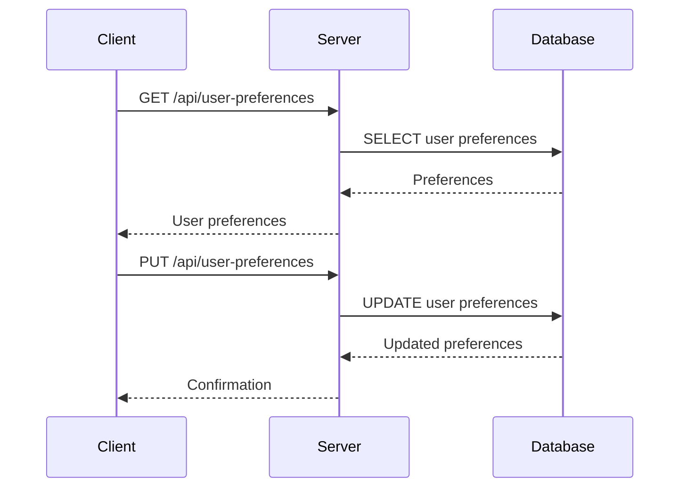
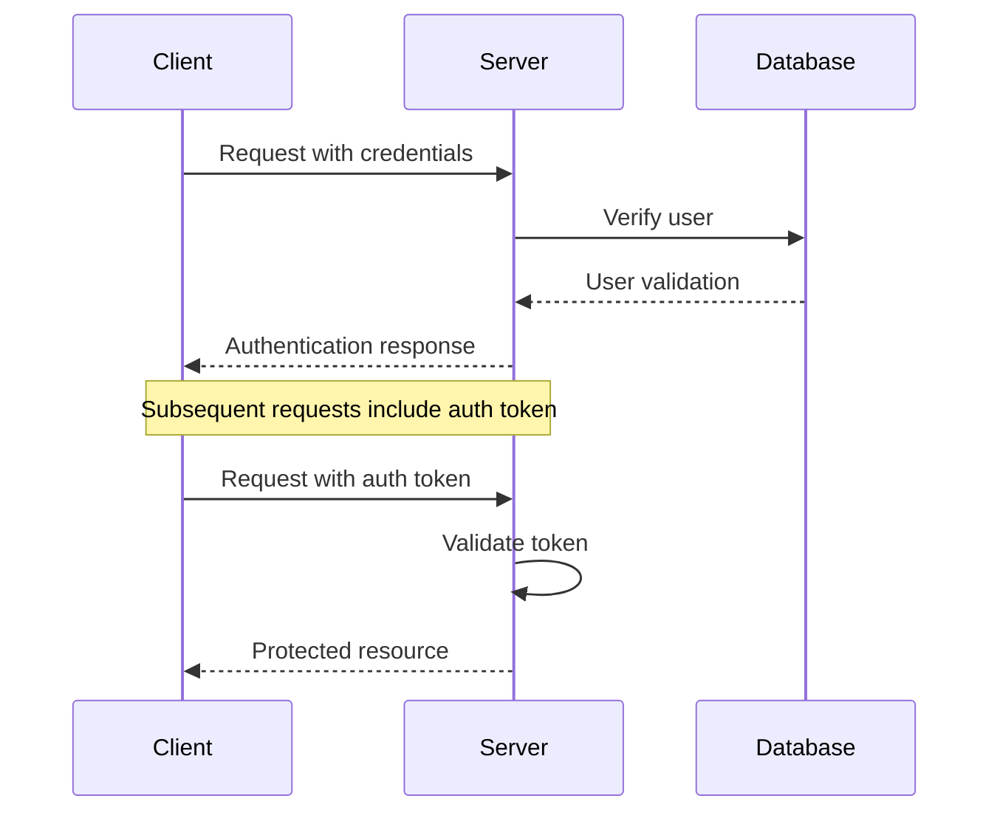

# Integration Architecture

## Overview
This document describes how the client and server parts of the Mysterious Website communicate and integrate with each other.

## Architecture Pattern
**Client-Server Architecture** with REST API + WebSocket real-time communication

## Integration Points

### Primary Communication Channels

#### 1. REST API Integration
**Direction:** Client → Server  
**Protocol:** HTTP/HTTPS  
**Base URL:** `http://localhost:8080/api`  
**Purpose:** CRUD operations, data synchronization, user actions

#### 2. WebSocket Integration  
**Direction:** Bidirectional  
**Protocol:** WebSocket (STOMP over SockJS)  
**Endpoint:** `ws://localhost:8080/ws/messages`  
**Purpose:** Real-time updates, live messaging, instant notifications

## Domain Integration Mapping

| Client Domain | Server Domain | Integration Type | Data Flow |
|---------------|---------------|------------------|-----------|
| `messagewall/` | `messagewall/` | REST + WebSocket | Bidirectional |
| `game/` | `game/` | REST | Client → Server |
| `user/` | `user/` | REST | Bidirectional |
| `suggestions/` | `suggestions/` | REST | Bidirectional |
| `vocabulary/` | `vocabulary/` | REST | Bidirectional |
| `calendar/` | `calendar/` | REST | Bidirectional |
| `note/` | `note/` | REST | Bidirectional |

## Detailed Integration Flows

### Message Wall Integration

#### REST API Flow


#### WebSocket Flow


### Game Integration

#### Score Submission Flow


#### Game State Management


### User Authentication Integration

#### Login Flow


#### User Preferences


## Data Formats and Contracts

### Request/Response Format
```json
{
  "success": boolean,
  "message": "string",
  "data": object | array
}
```

### Message Data Structure
```json
{
  "id": "string",
  "userId": "string",
  "name": "string", 
  "message": "string",
  "timestamp": "long",
  "isAnonymous": "boolean",
  "isVerified": "boolean",
  "quotedMessageId": "string|null",
  "quotedName": "string|null",
  "quotedMessage": "string|null"
}
```

### WebSocket Message Types
```javascript
// New message broadcast
{
  "type": "newMessage",
  "data": MessageObject
}

// Message deletion
{
  "type": "deleteMessage", 
  "data": { "id": "messageId" }
}

// Clear all messages
{
  "type": "clearAll",
  "data": {}
}

// Mute status change
{
  "type": "muteStatus",
  "data": { "muted": boolean }
}
```

## Error Handling and Resilience

### HTTP Status Codes
- `200 OK` - Successful request
- `201 Created` - Resource created successfully
- `400 Bad Request` - Invalid input data
- `401 Unauthorized` - Authentication required
- `404 Not Found` - Resource not found
- `500 Internal Server Error` - Server error

### WebSocket Error Handling
```javascript
// Connection error handling
client.onStompError = (frame) => {
  console.error('WebSocket error:', frame.headers['message']);
};

// Reconnection logic
const reconnect = () => {
  setTimeout(() => {
    connectWebSocket();
  }, 5000);
};
```

### Client-Side Error Handling
```typescript
// API client with error handling
const apiClient = {
  async getMessages(): Promise<Message[]> {
    try {
      const response = await fetch('/api/messages');
      if (!response.ok) {
        throw new Error(`HTTP error! status: ${response.status}`);
      }
      return await response.json();
    } catch (error) {
      console.error('Failed to fetch messages:', error);
      throw error;
    }
  }
};
```

## Performance Considerations

### API Optimization
- **Connection Pooling:** HikariCP for database connections
- **Response Compression:** Gzip compression enabled
- **Caching:** In-memory caching for frequently accessed data
- **Pagination:** Large datasets paginated

### WebSocket Optimization
- **Message Batching:** Multiple updates batched together
- **Connection Management:** Proper cleanup on disconnect
- **Message Filtering:** Only relevant messages sent to clients

### Frontend Optimization
- **Debouncing:** User input debounced to reduce API calls
- **Caching:** API responses cached in component state
- **Lazy Loading:** Components loaded on demand

## Security Integration

### Authentication Flow


### Authorization Patterns
- **Admin Codes:** Server-side admin verification
- **User Verification:** User existence validation
- **Resource Ownership:** Users can only modify their own resources
- **Anonymous Options:** Privacy features for sensitive operations

## Deployment Integration

### Container Networking
```yaml
# Docker Compose network configuration
networks:
  app-network:
    driver: bridge
    
services:
  client:
    networks:
      - app-network
    depends_on:
      - server
      
  server:
    networks:
      - app-network
    depends_on:
      - postgres
```

### Environment Configuration
```bash
# Client environment variables
VITE_API_BASE_URL=http://server:8080
VITE_WS_URL=ws://server:8080/ws/messages

# Server environment variables  
SPRING_DATASOURCE_URL=jdbc:postgresql://postgres:5432/messagewall
```

## Monitoring and Observability

### Integration Health Checks
```bash
# API health check
curl http://localhost:8080/actuator/health

# WebSocket connection test
wscat -c ws://localhost:8080/ws/messages
```

### Logging Integration
```javascript
// Client-side logging
const logger = {
  info: (message, data) => {
    console.log(`[Client] ${message}`, data);
    // Send to server for centralized logging
  }
};

// Server-side logging
@SLF4J
@RestController
public class MessageController {
    private static final Logger log = LoggerFactory.getLogger(MessageController.class);
    
    @PostMapping("/messages")
    public ResponseEntity<Message> addMessage(@RequestBody Message message) {
        log.info("Received message from user: {}", message.getUserId());
        // Process message
    }
}
```

## Future Integration Enhancements

### Planned Improvements
1. **API Versioning:** Versioned API endpoints
2. **GraphQL:** More flexible data querying
3. **Event-Driven Architecture:** Message queue integration
4. **Microservices:** Service decomposition for scalability
5. **CDN Integration:** Static asset distribution

### Scalability Considerations
- **Load Balancing:** Multiple server instances
- **Database Scaling:** Read replicas and sharding
- **Caching Layer:** Redis for distributed caching
- **Message Queue:** RabbitMQ for async processing
